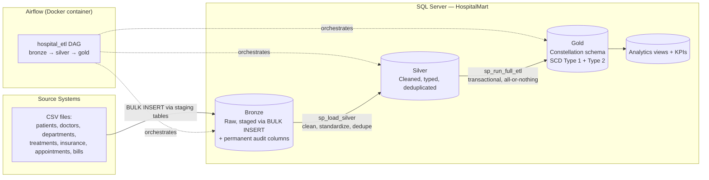
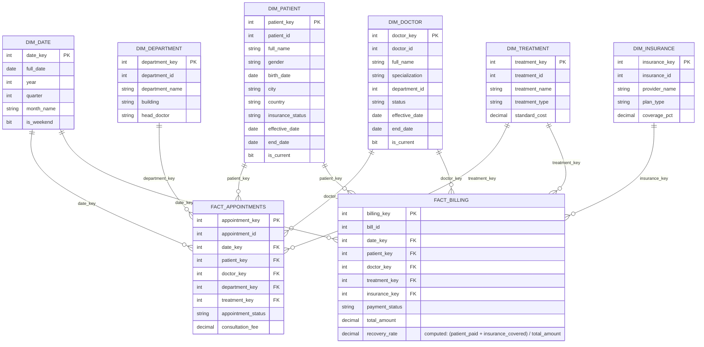

# Hospital Data Warehouse

An end-to-end data warehouse built on a Medallion (Bronze → Silver → Gold) architecture, orchestrated with Apache Airflow in Docker, running on SQL Server. Built as a portfolio project covering data modeling, ETL/ELT design, SCD history tracking, pipeline orchestration, and reproducible infrastructure.

## Architecture



**Why Bronze uses staging tables:** `BULK INSERT` maps columns positionally to *every* column of its target table, with no way to skip columns. Since the Bronze tables carry permanent audit columns (`dwh_source`, `dwh_load_date`) that don't exist in the source CSVs, each table has a `_stg` counterpart shaped exactly like the CSV. `BULK INSERT` always lands there; a plain `INSERT...SELECT` then moves the data into the real table with the audit columns appended. This keeps the load idempotent and safe to re-run any number of times.

## Gold layer schema

A constellation schema: six dimensions shared across two fact tables.



**`dim_patient` and `dim_doctor` are Slowly Changing Dimension Type 2** — a change to insurance status, city, country (patient) or specialization, department, status (doctor) expires the old row (`is_current = 0`, `end_date` set) and inserts a new current row, preserving full history for point-in-time analysis. **`dim_department`, `dim_treatment`, `dim_insurance` are Type 1** — they're overwritten in place, since their attributes don't need historical tracking for this use case.

## Pipeline behavior

- **Idempotent at every layer.** Bronze, Silver, and Gold DDL all use `IF OBJECT_ID(...) IS NULL` guards — the full setup can be re-run any number of times without dropping existing data or breaking foreign keys.
- **Fact tables update, not just insert.** `sp_load_fact_appointments` and `sp_load_fact_billing` check for changes to mutable fields (status, amounts) on rows already loaded, and update them — an appointment that moves from `Scheduled` to `Completed` after its first load is reflected in Gold, not stuck at its original state.
- **The Gold ETL run is transactional.** `dbo.sp_run_full_etl` wraps all dimension and fact loads in a single transaction. If any step fails, everything in that run rolls back — Gold is never left half-updated.
- **Bronze/Silver/Gold each run through their own dedicated Airflow task**, so a failure at any layer is visible in the Airflow UI with that layer's own logs, rather than one opaque "the pipeline failed" signal.

## Tech stack

| Layer | Technology |
|---|---|
| Database | SQL Server (Express) |
| Orchestration | Apache Airflow (`standalone` mode) |
| Containerization | Docker / Docker Compose |
| Load | T-SQL stored procedures, `BULK INSERT` |
| Transformation | T-SQL (Bronze → Silver → Gold) |
| Analytics | SQL views + KPI queries |

## Repository structure

```
hospital-data-warehouse/
│
├── .env.example
├── .gitignore
├── docker-compose.yml
│
├── airflow/
│   ├── dags/
│   │   └── hospital_etl.py
│   ├── logs/
│   └── plugins/
│
└── sql/
    ├── 01_bronze_layer.sql
    ├── 01_bronze_layer_storedprocedures.sql
    ├── 02_silver_layer.sql
    ├── 02_silver_layer_storedprocedures.sql
    ├── 03_gold_ddl.sql
    ├── 04_ETL_procedures.sql
    └── 05_analytics_views.sql
```

## Running this project

1. Clone the repo and copy `.env.example` to `.env`, filling in your own SQL Server credentials (see **Security** below — never commit real credentials).
2. Ensure SQL Server has TCP/IP enabled on a static port, and a dedicated SQL Server Authentication login exists with `db_datareader`, `db_datawriter`, `EXECUTE`, and `ALTER` permissions on the `bronze`/`silver` schemas (Windows Authentication cannot be used from inside a container).
3. Run the SQL files in `sql/` in numeric order once, against your database, to create the schema and stored procedures.
4. `docker compose up` to start Airflow.
5. Open the Airflow UI, trigger the `hospital_etl` DAG, and confirm all three tasks (bronze, silver, gold) succeed.

## Security

- No credentials are committed to this repository. `.env` is git-ignored; `.env.example` shows the required variable names only.
- The pipeline authenticates as a dedicated, least-privilege SQL Server login rather than a personal or administrative account.

## Known limitations / Future work

- **dbt migration (Silver → Gold) is not yet implemented.** The current Gold layer is built with T-SQL stored procedures. A planned follow-up is migrating the Silver-to-Gold transformation logic into dbt models (as snapshots for the SCD Type 2 dimensions), while leaving Bronze/Silver loading as-is — a common real-world hybrid rather than a full rewrite.
- Bronze/Silver do not currently log or quarantine rejected rows (e.g. malformed CSV rows dropped during Silver cleaning) — they are silently excluded rather than tracked for review.
- The pipeline currently loads from local CSV files; there's no incremental/streaming ingestion from the source systems it models.
